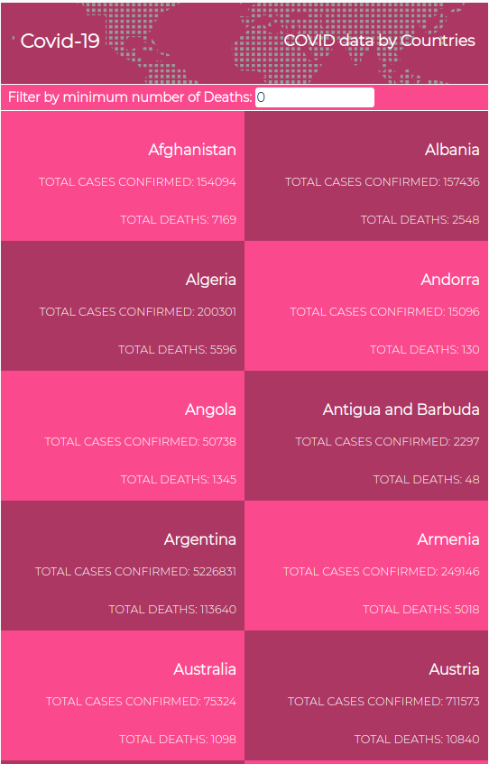
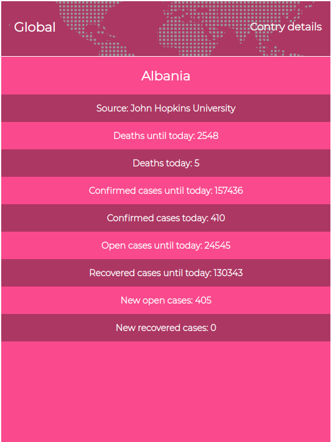

# COVID NEWS APP

> This is a mobile web app the provides daily updates on the global spread of covid-19. The data is sourced from the [Narrativa Data API](https://covid19tracking.narrativa.com/index_en.html). The project is build with React a JavaScript library, and Redux for state management. 

The app displays the global statistics on the spread of covid-19 for each country, number of confirmed cases and deaths. You click on a particular country to get detailed information about that country. 

## Built With

- HTML 5
- CSS3
- JAVASCRIPT
- REACT
- REDUX

## Video Presentation

[Checkout my video presentation](https://www.loom.com/share/b3d3cd18e24d42e5b88aa666f158cc38)

## Live Demo

[Checkout the live version](https://reverent-hoover-d8f9a0.netlify.app/)

## Getting Started
To get a local copy up and running follow these simple example steps.
- Open your terminal
- Clone the repository: `git clone git@github.com:Mihndim2020/React-capstone-project---Metrics-webapp.git`
- Cd into 
- Run npm install to install dependencies
- Run npm start to run the app on the browser

### Prerequisites
- Node v14.9.0 or above
- Browsers: Chrome, Firefox, Safari.

## Author

👤 **Mih Julius**

- Github: [@Mihndim2020](https://github.com/Mihndim2020)
- Twitter: [@mihndim](https://github.com/mih-julius)
- Linkedin: [Mih Julius](https://www.linkedin.com/mih-julius)

## 🤝 Contributing

Contributions, issues, and feature requests are welcome!

Feel free to check the [issues page](https://github.com/mrigorir/pokemon-world/issues).

## Show your support

Give a ⭐️ if you like this project!

## Acknowledgments

- Microverse community
- The Odin project
- W3Schools
- MDN
- Original design idea by [Nelson Sakwa on Behance](https://www.behance.net/gallery/31579789/Ballhead-App-%28Free-PSDs%29)

## 📝 License

This project is [MIT](./MIT.md) licensed.
